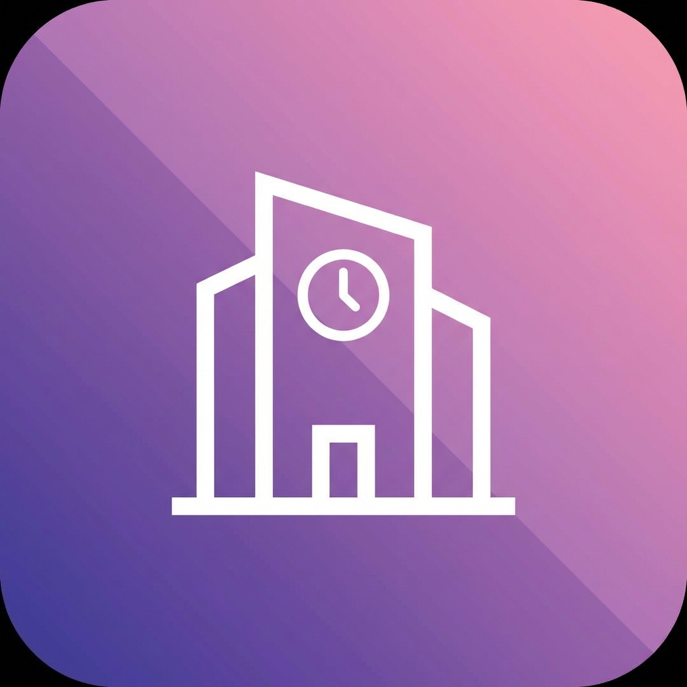

# HR Management System

ລະບົບບໍລິຫານຊັບພະຍາກອນມະນຸດ ສຳລັບ 20 ພະນັກງານ ດ້ວຍການກົດเຂົ້າ-ອອກວຽກແບບ GPS, ການຂໍລາອອນໄລນ໌, ແລະການຄິດໄລ່ເງິນເດືອນອັດຕະໂນມັດ



## ✨ Features

### 🎯 ສຳລັບພະນັກງານ
- ✅ ກົດເຂົ້າ-ອອກວຽກດ້ວຍ GPS (ຕ້ອງຢູ່ໃນຮັດສະໝີ 100m)
- ✅ ເບິ່ງປະຫວັດການເຂົ້າວຽກ (ປະຈຳວັນ/ເດືອນ/ປີ)
- ✅ ຂໍລາພັກອອນໄລນ໌ (ລາປ່ວຍ/ລາປະຈຳປີ)
- ✅ ເບິ່ງໂຄຕ້າການລາທີ່ເຫຼືອ
- ✅ ເບິ່ງສະລິບເງິນເດືອນປະຈຳເດືອນ
- ✅ ແຈ້ງການເມື່ອການລາຖືກອະນຸມັດ/ປະຕິເສດ

### 👔 ສຳລັບ Admin
- ✅ Dashboard ພາບລວມ Real-time
- ✅ ຈັດການຂໍ້ມູນພະນັກງານ (CRUD)
- ✅ ອະນຸມັດ/ປະຕິເສດການລາ
- ✅ ລາຍງານການເຂົ້າວຽກ (ວັນ/ເດືອນ/ປີ)
- ✅ ຄຳນວນແລະອອກເງິນເດືອນ
- ✅ Export ລາຍງານເປັນ Excel

## 🛠 Technology Stack

| Layer | Technology | Version |
|-------|------------|---------|
| **Frontend** | HTML + Vanilla JS | - |
| **Styling** | Tailwind CSS (CDN) | 3.x |
| **Backend** | Google Apps Script | V8 |
| **Database** | Google Sheets | - |
| **Auth** | PIN-based (4 digits) | - |
| **Maps** | Geolocation API | - |
| **Icons** | Lucide Icons | Latest |
| **Hosting** | Vercel (Free) | - |

**ເປັນຫຍັງຈຶ່ງໃຊ້ Google Sheets?**
- ✅ ຟຣີ 100% (ບໍ່ມີຄ່າໃຊ້ຈ່າຍ)
- ✅ Auto-backup ທຸກ version
- ✅ ເຂົ້າເຖິງງ່າຍ (Browser-based)
- ✅ Collaboration ໄດ້
- ✅ Export Excel ທັນທີ
- ✅ ຮອງຮັບ 10 ລ້ານ cells = **ໃຊ້ໄດ້ 15+ ປີ**

## 📦 Project Structure

```
Dsax_HRM/
├── index.html              # User PWA (ພະນັກງານ)
├── admin.html              # Admin Panel (ຕໍ່ໄປ)
├── manifest.json           # PWA config
├── sw.js                   # Service worker
│
├── icons/                  # App icons
│   ├── icon-192.png
│   └── icon-512.png
│
├── backend/                # Google Apps Script
│   ├── Code.gs            # Main API
│   └── Config.gs          # Configuration
│
├── database/              # Google Sheets setup
│   └── SETUP_GUIDE.md     # Step-by-step guide
│
└── project overview.txt   # CRISP-DM plan
```

## 🚀 Quick Start

### 1️⃣ Setup Google Sheets

ປະຕິບັດຕາມຄູ່ມື → [`database/SETUP_GUIDE.md`](database/SETUP_GUIDE.md)

**TL;DR:**
1. ສ້າງ Google Sheets ໃໝ່
2. ສ້າງ 7 sheets: `employees`, `attendance`, `leave_requests`, `leave_balances`, `payroll`, `departments`, `config`
3. ໃສ່ column headers ແລະ validation rules
4. ເພີ່ມຂໍ້ມູນ test 2-3 ແຖວ

### 2️⃣ Deploy Backend API

1. ເປີດ Google Sheets → **Extensions** → **Apps Script**
2. Copy code ຈາກ `backend/Config.gs` ແລະ `backend/Code.gs`
3. **ຕັ້ງຄ່າ** `SPREADSHEET_ID` ໃນ `Config.gs`
4. **Deploy** → **New Deployment** → **Web app**
   - Execute as: **Me**
   - Who has access: **Anyone**
5. Copy **Web App URL**

### 3️⃣ Configure PWA

ປັບແກ້ `index.html` ທີ່ແຖວ 42:

```javascript
const CONFIG = {
  API_URL: 'YOUR_WEB_APP_URL_HERE',  // ← Paste URL ຈາກຂັ້ນທີ 2
  OFFICE_LAT: 17.96256861597294,     // ← GPS ຫ້ອງການຂອງທ່ານ
  OFFICE_LNG: 102.64162015571948,    // ← GPS ຫ້ອງການຂອງທ່ານ
  RADIUS: 100
};
```

### 4️⃣ Run Locally

```bash
# ວິທີທີ 1: Python HTTP Server
python -m http.server 8000

# ວິທີທີ 2: Node.js HTTP Server
npx serve .

# ວິທີທີ 3: VS Code Live Server
# Right-click index.html → Open with Live Server
```

ເປີດ browser: `http://localhost:8000`

**Login ສຳລັບ Demo:**
- Employee ID: `EMP001`
- PIN: `1234`

### 5️⃣ Deploy to Vercel

```bash
# Install Vercel CLI
npm i -g vercel

# Deploy
vercel

# ຕອບຄຳຖາມ:
# - Project name: dsax-hrm
# - Framework: Other
# - Output directory: .
```

ຫຼື ໃຊ້ Vercel Dashboard:
1. Import Git repository
2. Deploy

---

## 📱 How to Use (User)

### ກົດເຂົ້າວຽກ
1. ເປີດ app ໃນ browser ຫຼື Install PWA
2. Login ດ້ວຍ Employee ID + PIN
3. ກົດ **"ກວດສອບ"** ເພື່ອກວດຕຳແໜ່ງ GPS
4. ຖ້າຢູ່ໃນຂອບເຂດ 100m → ກົດ **"ເຂົ້າວຽກ"**
5. ລະບົບຈະບັນທຶກເວລາແລະ GPS

### ກົດອອກວຽກ
1. ເວລາອອກວຽກ → ກົດ **"ກວດສອບ"** ອີກຄັ້ງ
2. ກົດ **"ອອກວຽກ"**
3. ລະບົບຄິດໄລ່ຊົ່ວໂມງເຮັດວຽກອັດຕະໂນມັດ

### ຂໍລາ
1. Tab **"ໂປຣໄຟລ໌"** → ກົດ **"ຂໍລາພັກ"**
2. ເລືອກປະເພດ: ລາປ່ວຍ/ລາປະຈຳປີ
3. ເລືອກວັນທີເລີ່ມ-ສິ້ນສຸດ
4. ໃສ່ເຫດຜົນ → **ສົ່ງຄຳຂໍ**
5. ລໍຖ້າ Admin ອະນຸມັດ

---

## 👔 How to Use (Admin)

### Dashboard
- ເບິ່ງສະຖິຕິ Real-time: ຈຳນວນຄົນເຂົ້າວຽກ, ມາສາຍ, ລາ
- ເບິ່ງ Chart: Attendance trends, Leave patterns
- Export ລາຍງານເປັນ Excel

### ອະນຸມັດການລາ
1. Tab **"Leave Approvals"**
2. ເບິ່ງລາຍການຄຳຂໍທີ່ລໍຖ້າ
3. ກົດ **"Approve"** ຫຼື **"Reject"**
4. ພະນັກງານຈະໄດ້ຮັບແຈ້ງການ

### ອອກເງິນເດືອນ
1. Tab **"Payroll"**
2. ເລືອກເດືອນ
3. ກົດ **"Generate Payroll"**
4. ລະບົບຄິດໄລ່:
   - ເງິນເດືອນພື້ນຖານ
   - ເງິນ OT (ຈາກ attendance)
   - ພາສີ (10% ຖ້າ > 4.5M LAK)
   - ປະກັນສັງຄົມ (5.5%)
5. Export ສະລິບເງິນເດືອນ

---

## 🔒 Security

### Authentication
- ໃຊ້ PIN 4 ໂຕເລກ (ພຽງພໍສຳລັບ 20 ຄົນ)
- ບໍ່ມີ password recovery (Admin reset ໃຫ້)
- Session ເກັບໃນ localStorage (ຄວນອັບເກຣດເປັນ JWT)

### GPS Validation
- ກວດ GPS ທັງ check-in ແລະ check-out
- Geofencing 100m radius
- ບັນທຶກ coordinates ສຳລັບ audit trail

### Data Protection
- Google Sheets ມີ auto-backup
- Protect ບາງ column (PIN, Salary) ດ້ວຍ permission
- HTTPS only (ບັງຄັບໂດຍ Vercel)

### OWASP Top 10 Coverage
- ✅ Input validation (data validation rules)
- ✅ HTTPS enforced
- ⚠️ No XSS protection (vanilla JS)
- ⚠️ No CSRF token (ຄວນເພີ່ມ)
- ⚠️ No rate limiting (Apps Script inherent)

---

## 📊 Performance

### Load Time
- First Paint: < 1s
- Interactive: < 2s (ເປົ້າໝາຍຕາມແຜນ)

### Offline Support
- Service worker caches app shell
- Failed requests queued in IndexedDB
- Auto-sync ເມື່ອກັບມາ online

### Scalability
- **ປັດຈຸບັນ:** 20 ພະນັກງານ
- **Maximum**: 100+ ຄົນ (Google Sheets limit: 10M cells)
- **Storage**: ~530KB/ປີ

---

## 🧪 Testing

### Manual Testing Checklist

**Attendance:**
- [ ] Check-in ຈາກຫ້ອງການ → ສຳເລັດ
- [ ] Check-in ຈາກບ້ານ (> 100m) → ປະຕິເສດ
- [ ] Check-in 2 ຄັ້ງໃນມື້ດຽວກັນ → Error
- [ ] Check-out ກ່ອນ check-in → Error
- [ ] ຄິດໄລ່ຊົ່ວໂມງຖືກຕ້ອງ (ຫັກພັກກາງວັນ 1 ຊົ່ວໂມງ)
- [ ] Status: on_time ຖ້າ check-in ≤ 08:15
- [ ] Status: late ຖ້າ check-in > 08:15

**Leave:**
- [ ] ສົ່ງຄຳຂໍລາສຳເລັດ
- [ ] ເບິ່ງໂຄຕ້າລາຖືກຕ້ອງ
- [ ] Admin ອະນຸມັດ → ສະຖານະປ່ຽນເປັນ approved
- [ ] Admin ປະຕິເສດ → ສະຖານະປ່ຽນເປັນ rejected

**General:**
- [ ] PWA installable
- [ ] Offline mode ເຮັດວຽກ
- [ ] Responsive ທຸກຂະໜາດຈໍ
- [ ] ພາສາລາວສະແດງຖືກຕ້ອງ

---

## 🐛 Known Issues

1. **GPS ບໍ່ແມ່ນຢູ່ໃນອາຄານ** - ຄວນໃຊ້ radius 300m
2. **Service worker cache** - ບາງຄັ້ງຕ້ອງ hard refresh
3. **Date timezone** - ຄວນໃຊ້ `Asia/Vientiane` ສະເໝີ
4. **No real-time updates** - ຕ້ອງ refresh ເພື່ອເຫັນຂໍ້ມູນໃໝ່

---

## 🚧 Roadmap

### Phase 2 (Next 2 weeks)
- [ ] Admin Panel UI
- [ ] Leave request form in user PWA
- [ ] Salary slip view
- [ ] Real API integration

### Phase 3 (Month 2)
- [ ] Push notifications
- [ ] Excel export
- [ ] Charts dashboard
- [ ] Bulk employee import

### Future
- [ ] Face recognition check-in
- [ ] WhatsApp/Telegram notifications
- [ ] Multi-language (Lo/En)
- [ ] Mobile apps (React Native)

---

## 📄 License

Internal use only - DSAX Company

---

## 👨‍💻 Support

ຖ້າມີບັນຫາ:
1. ອ່ານ [`database/SETUP_GUIDE.md`](database/SETUP_GUIDE.md)
2. ກວດ Console logs (F12)
3. ກວດ Apps Script logs
4. ຕິດຕໍ່ IT Department

---

**Built with ❤️ for DSAX Team**
